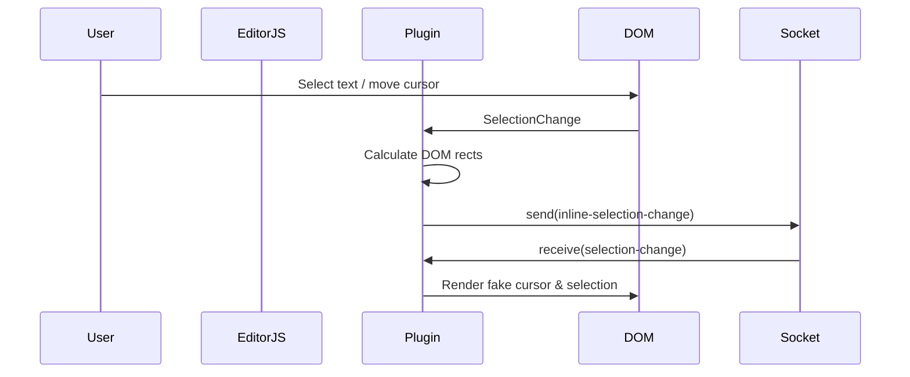

# EditorJS Realtime Collaboration Plugin

A realtime collaboration plugin for [Editor.js](https://editorjs.io)
that synchronizes block changes, cursor selections, and deletion states across multiple clients using your socket implementation of choice.

[Live Demo](https://sebmeister2077.github.io/editorjs-realtime-collab/)

## Features

- ✅ Realtime block add / update / move / delete

- ✅ Inline cursor & text selection visualization

- ✅ Block-level selection + pending deletion state

- ✅ Works with **any socket implementation**

- ✅ Type-safe TypeScript API

- ✅ Throttled updates for performance

## Installation

```shell
npm i editorjs-realtime-collab
```

## Basic Usage

```js
import EditorJS from '@editorjs/editorjs'
import RealtimeCollabPlugin from 'editorjs-realtime-collab'

const editor = new EditorJS({
    holder: 'editor',
    // other EditorJS config
})

const realtimeCollab = new RealtimeCollabPlugin({
    editor,
    socket: socketInstance,
})
```

Once instantiated, the plugin **automatically starts listening** for:

- Editor.js block mutations

- DOM selection changes

- Incoming socket messages

No extra setup is required.

## Socket Interface Contract

The plugin does **not** depend on Socket.IO, SignalR, or any specific library.

Your socket only needs to implement this interface:

```ts
interface NeededSocketFields<SocketEventName extends string> {
  send(event: SocketEventName, data: MessageData): void
  on(event: SocketEventName, callback: (data: MessageData) => void): void
  off(event: SocketEventName): void
  connectionId: string
}

```

`connectionId`

- Must uniquely identify the current user/session

- Used to ignore self-sent updates

- Used to associate cursors & selections with users

## Configuration Options

```ts
new RealtimeCollabPlugin({
  editor,
  socket,
  socketMethodName?,
  blockChangeThrottleDelay?,
  cursor?,
  overrideStyles?,
})


```

## Config Params

| Field                    | Type                                            | Description                                              | Default              |
| ------------------------ | ----------------------------------------------- | -------------------------------------------------------- | -------------------- |
| editor                   | `EditorJS`                                      | The editorJs instance you want to listen to              | `required*`          |
| socket                   | `INeededSocketFields`                                        | The socket instance (or custom method bingings)          | `required*`          |
| socketMethodName         | `string`                                        | The event name to use when communicating between sockets | `editorjs-update`    |
| blockChangeThrottleDelay | `number`                                        | Delay to throttle block changes (ms).                    | `300`                |
| cursor.color                   | `string`                             | Color of remote cursors configuration                                     | `#0d0c0f` |
| overrideStyles.cursorClass           | `string` | Override selected block class                                          | —                 |
| overrideStyles.cursorClass           | `string` | Override cursor CSS class                                          | —                 |
| overrideStyles.pendingDeletionClass           | `string` | Override delete-pending block class                                          | —                 |

## Listening Control

By default, the plugin starts listening immediately.

You can manually control listeners if needed:

```js
// Stop listening to editor + socket + DOM
realtimeCollab.unlisten()

// Re-enable all listeners
realtimeCollab.listen()

// Check listening state
if (realtimeCollab.isListening) {
  // ...
}
```

This is useful when:

- Temporarily disabling collaboration

- Switching documents

- Cleaning up in SPA route changes

## Examples

### Socket.IO

```ts
import { io } from 'socket.io-client'
const socketInstance = io('wss://example.com/chat')
const connectionId = "user-id"
new GroupCollab({
    editor,
    socket: { 
        ...socketInstance, 
        connectionId 
    },
})
```

### Microsoft SignalR

```ts
const connection = new signalR.HubConnectionBuilder()
  .withUrl('/chat')
  .build()
const connectionId = "user-id"
connection.start().then(() => {
    new GroupCollab({
        editor,
        socket: {
            send: connection.send.bind(connection),
            on: connection.on.bind(connection),
            off: connection.off.bind(connection),
            connectionId,
        },
    })
})
```

### Native WebSocket (Custom Binding)

```ts
const socket = new WebSocket('wss://example.com')

socket.addEventListener('open', async (e) => {
    const on = (eventName, callback) => {
        socket.addEventListener('message', (e) => {
            const isSameClient = e.currentTarget === socket
            if (isSameClient) return

            const splits = e.data.split(',')
            const receivedEventName = splits[0]
            if (eventName !== receivedEventName) return
            const data = JSON.parse(splits[1])
            callback(data)
        })
    }
    const send = (eventName, data) => {
        socket.send([eventName, JSON.stringify(data)])
    }
    const off = (eventName) => {
        /* handle unsubscribing logic */
    }
    const connectionId = "user-id"
    const groupCollab = new RealtimeCollabPlugin({
        editor,
        socket: {
            send,
            on,
            off,
            connectionId
        },
    })
})
```

### PieSocket Example

```ts
const pieSocket = new PieSocket.default({
    clusterId: 'free.blr2',
    apiKey: 'your-api-key',
})
const channel = await pieSocket.subscribe('channel-name')

const socket = {
    on: (name: string, cb: Function) => channel.listen(name, (data, meta) => cb(data)),
    send: (name: string, data: Object) => channel.publish(name, data),
    off: () => {
        /* unsubscribing logic */
    },
    connectionId: "user-id"
}

new RealtimeCollabPlugin({
    editor,
    socket,
})
```

---

### Message Types (Advanced)

Internally, data is synced using strongly typed messages that map directly to Editor.js mutations:

- Block added / removed / moved / changed

- Inline selection changes

- Block selection changes

- Pending deletion state

- User disconnect events

You generally **do not need to handle these manually** unless:

- You are proxying messages through a server

- You want to log or transform events

---

### Styling

The plugin injects default styles for:

- Remote cursors

- Inline selections

- Selected blocks

- Pending deletions

You can override any of them via `overrideStyles` or your own CSS.

---

### Gotchas & Notes

- ⚠️ `connectionId` must be stable for a user session

- ⚠️ Clients must all use the same `socketMethodName`

- ✅ Editor content stays consistent even with rapid concurrent edits

- ✅ Self-emitted events are automatically ignored
`

## Architecture Overview

### High-Level Architecture

```mermaid
graph TD
  UserA[User A<br/>Editor.js] -->|Block & Selection Events| PluginA[RealtimeCollabPlugin]
  PluginA -->|"send(MessageData)"| SocketA[Socket Adapter]
  SocketA -->|broadcast| Server[Relay Server]

  Server -->|MessageData| SocketB[Socket Adapter]
  Server -->|MessageData| SocketC[Socket Adapter]

  SocketB -->|on"(MessageData)"| PluginB[RealtimeCollabPlugin]
  SocketC -->|on"(MessageData)"| PluginC[RealtimeCollabPlugin]

  PluginB -->|Apply Mutations| UserB[User B<br/>Editor.js]
  PluginC -->|Apply Mutations| UserC[User C<br/>Editor.js]
```


### Selection & Cursor Sync

